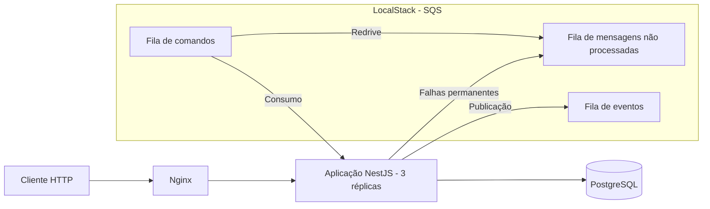
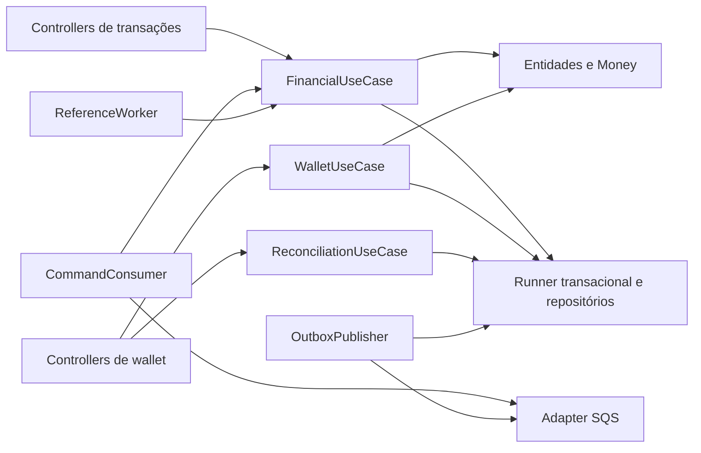
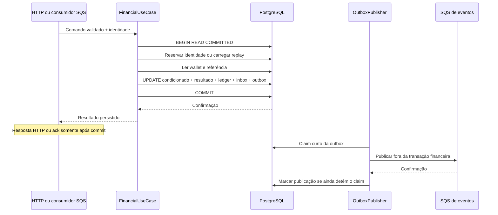
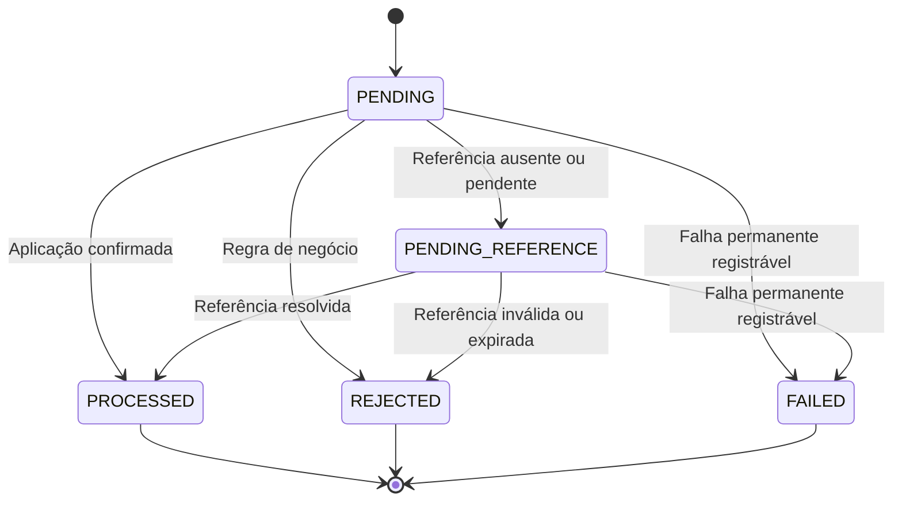

# Arquitetura e decisões

A solução concentra a autoridade financeira no **PostgreSQL**. HTTP e SQS são entradas alternativas para o mesmo caso de uso; nenhum deles mantém saldo ou decide idempotência fora do banco. A entrega é _at-least-once_: mensagens e eventos podem se repetir, mas uma identidade financeira não pode produzir um segundo efeito.

Este documento responde às decisões abertas no [CHALLENGE.md](CHALLENGE.md). O [README.md](README.md) contém setup, comandos, contratos operacionais e evidências de execução.

## 1. Visões de arquitetura

### Design de sistema: serviços e comunicação

Esta visão descreve os processos em execução, os serviços externos e os canais de comunicação. O ambiente local tem três réplicas da mesma aplicação, um gateway Nginx, um PostgreSQL e um LocalStack com as filas SQS.



O Nginx distribui o tráfego HTTP entre as réplicas. Elas compartilham o banco e as filas. O PostgreSQL mantém o estado financeiro e os registros de recuperação; o SQS transporta comandos e eventos. A fila de eventos está disponível para integrações externas e é observada pelos testes.

**Decisão:** replicar uma única aplicação, em vez de separar saldo, ledger e processamento financeiro em serviços. Assim, a confirmação financeira depende de uma transação no banco, sem coordenação remota entre esses dados.

**Execução local:** [compose.services.yaml](compose.services.yaml) reúne PostgreSQL, LocalStack e volumes; [compose.apps.yaml](compose.apps.yaml) reúne migrations, criação das filas, três aplicações e Nginx. Os dois arquivos formam um projeto Compose. O ambiente de testes usa as mesmas definições, com portas, banco e volumes separados por [docker/test.env](docker/test.env). Os seletores `JUNGLE_*` evitam conflitos com variáveis genéricas de outros projetos locais. Os testes mantêm os limites de 1.000 ms para locks e 2.000 ms por instrução SQL, usados no cenário de 50 requisições; o ambiente principal mantém os padrões de 250 ms e 1.000 ms.

### Arquitetura de software: componentes e responsabilidades

Esta visão descreve a organização interna de cada réplica. Controllers, casos de uso, entidades, repositórios e workers são componentes da mesma aplicação, não serviços independentes.



`FinancialUseCase` concentra a decisão financeira usada por HTTP, comandos e retomada de referências. `WalletUseCase` cuida da abertura e das consultas de wallet. `ReconciliationUseCase` compara o saldo materializado com o ledger. O runner delimita a transação; os repositórios executam as operações de persistência.

| Componente        | Responsabilidade implementada                                                                                                                  |
| ----------------- | ---------------------------------------------------------------------------------------------------------------------------------------------- |
| Domínio           | `Money`, wallet, transação, ledger, inbox, outbox e eventos; factories e transições explícitas, independentes de NestJS e de decorators de ORM |
| Casos de uso      | Validação de contexto, resolução de replay e referências, decisão do resultado e composição da transação                                       |
| Repositórios      | Leituras e inserções gerenciadas pelo ORM; condições financeiras, identidades e posse de trabalho em SQL, dentro da transação recebida         |
| Adapters HTTP/SQS | Validação de transporte, contexto e tradução de resultados para cada canal                                                                     |
| Workers           | Polling, leases, backoff, publicação após commit e recuperação de trabalho                                                                     |

Cada réplica do Compose executa HTTP e os três workers. Os papéis de worker são habilitados por configuração. Essa composição reutiliza o mesmo modelo financeiro, mas compartilha CPU e pool de conexões entre requisições e trabalho assíncrono.

As entidades usam construtores restritos e factories. `rehydrate` reconstrói estado persistido sem repetir regras de transição. As regras ficam nas entidades e no fluxo de aplicação; as invariantes críticas também existem no schema.

Os arquivos de casos de uso seguem `<nome>.use-case.ts`. Registros, repositórios e schemas ficam nos domínios `wallet`, `wagering`, `inbox` e `outbox`; wallet também reúne a persistência do ledger. `TransactionRepositories`, em `shared`, compõe esses repositórios para uma mesma tentativa. `core/database` mantém conexões, prazos, migrations e o helper comum `TransactionRecordStore`.

Pontos de leitura: [FinancialUseCase](src/domains/wagering/financial.use-case.ts), [entidades de wagering](src/domains/wagering/entities), [entidades de wallet](src/domains/wallet/entities) e [TransactionRepositories](src/shared/transaction-repositories.ts).

## 2. Dinheiro, ORM e persistência

### Representação monetária

[Money](src/shared/money.ts) é um objeto de valor imutável baseado na biblioteca **Decimal.js**. Uma configuração decimal local, com precisão de 100 dígitos, evita depender de alterações globais da biblioteca. Valores públicos são strings com escala fixa de duas casas; entrada fora desse formato é rejeitada, não arredondada.

O modelo suporta `BRL`, `USD` e `EUR`, sem câmbio. Somar moedas distintas é erro. Valores negativos servem apenas a cálculos internos e à diferença de reconciliação; contratos de entrada não os aceitam.

Na persistência, montante e moeda ocupam colunas separadas: **`NUMERIC(20,2)` + código de moeda**. O limite de armazenamento é `999999999999999999.99`; operação e saldo candidato são verificados antes da escrita. Registros SQL mantêm o montante como string e o reidratam em `Money` na fronteira do domínio. Somas da reconciliação permanecem no PostgreSQL sem redução ao limite da coluna de saldo.

**Trade-off:** a custo do uso de uma biblioteca externa no tratamento monetário, Decimal.js mantém operações de domínio legíveis e o contrato decimal exato. A aplicação valida escala e magnitude nas fronteiras de entrada e persistência.

Versões de wallet usam `BIGINT` no banco, incremento exato com `bigint` no domínio e **string** no contrato público. Isso evita perda de precisão acima do intervalo inteiro seguro de JavaScript. A versão começa em `"1"` e só aumenta quando o saldo muda.

### Uso deliberado do MikroORM

MikroORM mapeia os registros persistentes e executa as leituras comuns. Novas wallets, entradas de ledger e eventos da outbox usam inserções gerenciadas. Essas escritas são enviadas ao banco antes do SQL que depende delas, dentro da mesma transação financeira. As entidades de domínio e `Money` continuam independentes do ORM.

**Decisão:** os repositórios retornam registros sem rastreamento pelo ORM e fazem novas leituras do banco para decisões financeiras. Um `flush` posterior não grava uma mutação do domínio nem sobrescreve uma alteração nativa de saldo, status ou lease.

O SQL condicionado mantém todas as condições da wallet, a reserva concorrente de identidades, a posse dos workers e os snapshots de agregação. O ORM reduz o código de mapeamento e inserção; seu mapa de identidade não substitui essas garantias do banco.

O runner usa `EntityManager.commit()` para o flush final e a conclusão do commit. Mantém a aquisição cancelável do pool, uma conexão fixada por tentativa e o controle de prazo por instrução. MikroORM 6.6.17 não oferece as garantias de prazo total, cancelamento e commit incerto exigidas nesses pontos.

**Limite do schema:** as migrations SQL versionadas continuam sendo a autoridade. Os metadados apoiam o mapeamento e as relações por identificador, mas não substituem a chave estrangeira composta, os índices parciais, os checks ou os triggers de integridade diferidos. Não use sincronização automática de schema.

## 3. Concorrência e atomicidade

### Uma tentativa financeira



Inbox só participa quando a entrada é SQS. Rejeições reais também são persistidas com seu resultado e evento, mas sem alteração de saldo ou ledger. Replay não produz novos lançamentos nem novos eventos.

### Controle otimista por wallet

**Decisão:** isolamento `READ COMMITTED` e atualização atômica condicionada à versão, moeda e saldo esperados. Não há lock global nem `SELECT FOR UPDATE` prévio da wallet no fluxo financeiro comum. O próprio `UPDATE` ainda adquire o lock de linha normal do PostgreSQL.

Essa mecanismo também foi adotado para alinhar o sistema ao requisitado pelo desafio, como o uso explícito do `version`, e ser de implementação simples e direta.

Forma reduzida do SQL de [WalletRepository](src/domains/wallet/repositories/wallet.repository.ts):

```sql
UPDATE wallets
SET balance = :candidate_balance,
    version = version + 1,
    updated_at = clock_timestamp()
WHERE id = :wallet_id
  AND currency = :currency
  AND balance = :expected_balance
  AND version = :expected_version
RETURNING *;
```

O SQL real também limita saldo, escala, versão máxima e mudança efetiva do valor. O domínio calcula o candidato; o banco só o aceita se o estado lido ainda for válido.

**Zero linhas não significa saldo insuficiente.** Significa conflito da tentativa: rollback, nova leitura e nova avaliação de negócio. No cenário de duas apostas de `80.00` contra `100.00`, uma confirma `20.00`; a outra perde a condição de escrita, recarrega `20.00` e então registra `INSUFFICIENT_FUNDS`. Não existe segundo débito.

**Trade-off:** wallets distintas não disputam um lock de aplicação comum. Uma wallet muito concorrida pode consumir tentativas ou atingir timeout e retornar 503. A contenção é tratada como falha transitória, distinta de rejeição financeira. A documentação do teste de carga elabora mais sobre esse cenário.

### Retry e commit incerto

O runner classifica falhas por **SQLSTATE**, não por texto. Por padrão, admite até três tentativas, incluindo a primeira, dentro de um único prazo monotônico de cinco segundos.

| Ocorrência                                                      | Decisão                                                                                                 |
| --------------------------------------------------------------- | ------------------------------------------------------------------------------------------------------- |
| Atualização condicionada sem linha, `40001` ou `40P01`          | Repete a transação inteira após rollback confirmado, com novo EntityManager e prazo restante            |
| `55P03`, timeout de lock; `57014`, cancelamento/timeout SQL     | Retorna falha transitória, sem retry local                                                              |
| Entrada inválida, conflito de identidade ou rejeição de negócio | Encerra o processamento sem retry                                                                       |
| Perda de confirmação depois de enviar COMMIT                    | Retorna `DATABASE_COMMIT_OUTCOME_UNKNOWN`, sem retry interno, pois o resultado do commit é desconhecido |

O prazo inclui aquisição de conexão, SQL, callback, commit e backoff. Timeouts SQL são limitados pelo tempo restante. Uma consulta financeira não é abandonada com `Promise.race` enquanto continua usando a conexão.

O limite tem fronteiras: código JavaScript que nunca devolve controle não é cancelável à força; timeout no servidor não garante resposta de rede nem prova rollback. O cliente recupera um commit incerto pela **mesma identidade**. O Nginx não faz retry automático de upstream.

## 4. Garantias no schema

A [migration inicial](src/core/database/migrations/Migration20261003000001_InitialSchema.ts) compõe [tabelas e índices](src/core/database/migrations/20261003000001/tables.sql), [triggers](src/core/database/migrations/20261003000001/triggers.sql) e [funções de integridade](src/core/database/migrations/20261003000001/functions).

| Garantia                             | Mecanismo persistente                                                                     |
| ------------------------------------ | ----------------------------------------------------------------------------------------- |
| Uma wallet por jogador/moeda         | Unicidade de `(player_id, currency)`                                                      |
| Saldo não negativo e valores exatos  | `NUMERIC`, checks e escrita condicionada                                                  |
| Uma identidade financeira            | Unicidade de provedor/chave e de provedor/ID externo                                      |
| Ledger sem duplicata                 | Unicidade por wallet/transação e por sequência de wallet                                  |
| Ledger imutável                      | `prevent_ledger_mutation` impede UPDATE, DELETE e TRUNCATE                                |
| Saldo e ledger coerentes no commit   | Constraints triggers diferidas verificam wallet, lançamento, transação e cadeia de saldos |
| Resultado terminal imutável          | `guard_transaction_change` protege transação e resultado após encerramento                |
| Contexto e referência válidos        | Verificações diferidas de wallet/jogador/moeda, referência, tipo, valor e estado          |
| Uma reversão aplicada por referência | Índice único parcial sobre a referência para `REFUND`/`ROLLBACK` processados              |
| Deduplicação de mensagem             | Identidade única `(consumer_name, message_id)` na inbox                                   |
| Recuperação de trabalho abandonado   | Agenda persistente, lease e token de posse nas referências e na outbox                    |

As verificações diferidas permitem inserir os componentes em etapas da mesma transação, mas rejeitam o commit de um conjunto incoerente. Elas impedem lançamentos financeiros para `LOSS` e operações rejeitadas. Rejeições sem wallet válida são registradas para auditoria, sem saldo observado.

Os índices de trabalho restringem a busca a referências pendentes e eventos ainda não publicados. A sequência do ledger sustenta a paginação por wallet. Essas escolhas reduzem a leitura do histórico já encerrado sem introduzir um cache como fonte de correção.

**Limite de confiança:** `jungle_main` não é superuser, mas é owner do schema e executa migrations. Constraints protegem a escrita normal; um administrador pode alterar o schema ou desabilitar essas proteções. O projeto usa a mesma identidade para runtime e migrations para simplificar a execução local. A separação dessas permissões permanece fora da implementação.

## 5. Idempotência e replay

Há três identidades diferentes, com escopos explícitos:

| Identidade                            | O que impede                                                     |
| ------------------------------------- | ---------------------------------------------------------------- |
| `(providerId, idempotencyKey)`        | Reaplicação da mesma requisição financeira                       |
| `(providerId, externalTransactionId)` | Segunda operação sob outra chave para a mesma identidade externa |
| `(consumerName, messageId)`           | Reexecução da mesma mensagem lógica por redelivery               |

A reserva da operação usa inserção protegida por unicidade e resolução do registro concorrente.

### Algoritmo do hash

[canonical-hash.ts](src/shared/canonical-hash.ts) implementa a versão **v1**:

1. Seleciona os campos de negócio validados: `providerId`, `externalTransactionId`, `playerId`, `walletId`, `roundId`, `gameId`, `kind`, `money` e `referenceExternalTransactionId`, quando presente.
2. Ordena recursivamente as chaves dos objetos e serializa o JSON canônico.
3. Aplica SHA-256 e persiste o hash com a versão da canonicalização.

A chave de idempotência e metadados de transporte não entram no hash financeiro. Strings validadas não sofrem normalização silenciosa. Referência omitida é ausência; `null` não é uma representação alternativa válida.

- **Mesma chave, mesmo payload:** resultado persistido, com `idempotentReplay: true`.
- **Mesma chave, outro payload:** `WAGER_IDEMPOTENCY_CONFLICT`.
- **Outra chave, mesmo ID externo:** `WAGER_EXTERNAL_IDENTITY_CONFLICT`, mesmo com payload igual. Não há aliases de chave.

O snapshot terminal inclui saldo e versão observados naquela decisão, inclusive em `LOSS` e rejeições com wallet válida. Não consulta o saldo atual para compor replay. Uma pendência retorna seu resultado durável sem outro evento ou extensão de prazo; depois da resolução, passa a retornar o resultado terminal.

A inbox tem **outro hash**, do envelope lógico com `type`, `occurredAt` e `data`, sem metadados atribuídos pelo SQS. Reutilizar `messageId` com envelope divergente é conflito permanente: o original é preservado e a entrega divergente vai para a DLQ.

**Trade-off:** guardar resultado e identidades consome armazenamento, mas remove a ambiguidade do replay após reinício ou movimentação posterior da wallet. Não há limpeza automática desses registros; retenção exige uma política que preserve a janela de idempotência prometida ao provedor.

## 6. Interpretações de negócio e estados

Estas são escolhas adicionais ao enunciado, não regras inferidas do broker:

| Tema                           | Decisão e consequência                                                                                                                                           |
| ------------------------------ | ---------------------------------------------------------------------------------------------------------------------------------------------------------------- |
| Valor zero                     | `BET`, `WIN`, `REFUND` e `ROLLBACK` exigem valor positivo. `LOSS` aceita zero ou positivo sem movimentar saldo                                                   |
| Abertura                       | Saldo positivo cria `OPENING` interno, crédito e eventos no mesmo commit. Saldo zero não cria esses registros. Ambos começam na versão um                        |
| Namespace interno              | `__internal__` é reservado; `OPENING` não entra por HTTP ou SQS                                                                                                  |
| Referência opcional            | `WIN` pode referenciar uma BET processada sem exigir valor igual. Referências fornecidas em `BET` e `LOSS` também passam pelas verificações de contexto e estado |
| Escopo da referência           | Resolução por provedor/ID externo; exige o mesmo jogador, wallet, moeda e rodada. Não exige igualdade de `gameId`                                                |
| Referência ausente ou pendente | Mantém `PENDING_REFERENCE`; incompatibilidade já conhecida é rejeitada antes de esperar                                                                          |
| Exclusividade da reversão      | **Uma única reversão processada, seja REFUND ou ROLLBACK, por referência**                                                                                       |
| Cadeia de reversão             | Reverter um REFUND não libera outra reversão da BET original; ROLLBACK não pode referenciar outro ROLLBACK                                                       |
| Rodada                         | Não há aposta única, WIN único ou exclusão WIN/LOSS além das identidades e regras de referência                                                                  |

A exclusividade entre tipos é **mais restritiva** que a leitura literal de “uma vez pelo mesmo tipo” da seção 7. Ela impede que REFUND e ROLLBACK devolvam duas vezes o mesmo débito. O custo é rejeitar uma segunda reversão de outro tipo que essa leitura permitiria. A regra é intencional e protegida por índice, não apenas por uma consulta antes da escrita.

### Máquina de estados



`PENDING` é o estado inicial de reserva. A pendência durável exposta é `PENDING_REFERENCE`. Enquanto espera, o worker pode apenas reagendar o trabalho; não volta a `PENDING`. Estados terminais não reabrem, mesmo se o saldo ou a referência mudarem depois.

`processedAt` só registra aplicação; `closedAt` registra encerramento de rejeição ou falha. `FAILED` está previsto para infraestrutura comprovadamente permanente e registrável sem efeito financeiro. Timeout, commit incerto ou esgotamento de redrive **não** são convertidos automaticamente em `FAILED`. Uma mensagem na DLQ pode não ter transação correspondente.

## 7. Códigos de falha

A resposta persistida usa `failureCode`; exceções de contrato/infraestrutura usam `code` no envelope seguro. Esses códigos identificam a falha sem depender do texto da mensagem. Uma rejeição é terminal: o reenvio da mesma operação não a reavalia.

| `failureCode` durável                                                                                               | Significado                                                              |
| ------------------------------------------------------------------------------------------------------------------- | ------------------------------------------------------------------------ |
| `INSUFFICIENT_FUNDS`                                                                                                | BET sem saldo                                                            |
| `INSUFFICIENT_REFUND_BALANCE`                                                                                       | Débito de reversão causaria saldo negativo                               |
| `BALANCE_OVERFLOW`                                                                                                  | Saldo candidato excede o limite de armazenamento                         |
| `WALLET_VERSION_EXHAUSTED`                                                                                          | Sequência atingiu o limite de BIGINT                                     |
| `WALLET_NOT_FOUND`                                                                                                  | Wallet não encontrada; resultado sem saldo observado                     |
| `WALLET_PLAYER_MISMATCH`, `WALLET_CURRENCY_MISMATCH`                                                                | Contexto da operação não corresponde à wallet                            |
| `REFERENCE_INVALID_STATE`                                                                                           | Referência terminal incompatível com a aplicação                         |
| `REFERENCE_TYPE_MISMATCH`                                                                                           | Tipo da referência não é permitido para essa operação                    |
| `REFERENCE_PLAYER_MISMATCH`, `REFERENCE_WALLET_MISMATCH`, `REFERENCE_CURRENCY_MISMATCH`, `REFERENCE_ROUND_MISMATCH` | Contexto da operação não corresponde à referência                        |
| `REFERENCE_AMOUNT_MISMATCH`                                                                                         | Reversão parcial ou valor divergente; somente reversão integral é aceita |
| `REFERENCE_ALREADY_REVERSED`                                                                                        | Referência já tem uma reversão processada                                |
| `REFERENCE_EXPIRED`                                                                                                 | Prazo da dependência esgotado; a chegada posterior não reabre a operação |

Uma referência de outro provedor não é resolvida por busca global: dentro do namespace atual, pode aparecer como ausente e expirar. Isso evita usar operações de outro provedor como dependências.

Conflitos `WAGER_IDEMPOTENCY_CONFLICT` e `WAGER_EXTERNAL_IDENTITY_CONFLICT` retornam 409 sem substituir o registro original. Infraestrutura transitória usa 503, incluindo `DATABASE_LOCK_TIMEOUT`, `DATABASE_POOL_EXHAUSTED` e `DATABASE_COMMIT_OUTCOME_UNKNOWN`. A criação duplicada usa `WALLET_ALREADY_EXISTS`/409. O mapa HTTP completo está no README.

## 8. Processamento assíncrono e recuperação

### Comandos: inbox antes do ack

[CommandConsumer](src/domains/messaging/command-consumer.ts) mantém uma mensagem ativa por instância. Valida o envelope, obtém o contexto do provedor e chama `FinancialUseCase.executeCommand`. A marcação de inbox processada participa da mesma transação do resultado financeiro.

| Resultado da entrega                                 | Tratamento                                                                         |
| ---------------------------------------------------- | ---------------------------------------------------------------------------------- |
| Operação aplicada, rejeitada ou pendência persistida | Ack após commit; a pendência passa a ser responsabilidade do worker de referências |
| Falha transitória                                    | Sem ack; backoff pela visibilidade e redrive do broker                             |
| Envelope inválido ou conflito permanente             | Envia à DLQ e remove a mensagem de origem após a confirmação do envio              |
| Falha de renovação de visibilidade                   | Mantém a mensagem sem ack para recuperação por redelivery                          |

A renovação de visibilidade é serializada e termina antes de aplicar o backoff. Chamadas ao broker têm prazo finito e não acumulam retries automáticos do SDK sobre os retries do worker. A DLQ preserva o corpo original; sua deduplicação de transporte deriva da URL de origem e do corpo.

### Referências: agenda persistente com TTL

[ReferenceWorker](src/domains/wagering/reference-worker.ts) usa claims curtos com `FOR UPDATE SKIP LOCKED`, lease e token por registro. A retomada usa a mesma decisão financeira da entrada inicial, mas não reserva outra operação nem emite novamente o evento de pendência.

**Decisão:** TTL padrão de **24 horas**, contado da primeira aceitação durável, e backoff exponencial limitado a 60 segundos. O TTL dá uma janela explícita para entrega atrasada sem manter uma dependência órfã indefinidamente. É uma escolha operacional configurável.

O relógio autoritativo é o do PostgreSQL. Replay não renova prazo. Enquanto a referência falta, a próxima tentativa respeita a expiração original. Ao expirar, uma tentativa de worker rejeita com `REFERENCE_EXPIRED` e grava o evento correspondente. Se essa tentativa falhar por infraestrutura, o backoff persiste: expiração não vira um laço de execução contínua. O TTL torna a rejeição elegível; não garante encerramento pontual durante indisponibilidade.

### Outbox: claim, envio e marcação separados

[OutboxPublisher](src/domains/messaging/outbox-publisher.ts) obtém lotes por `SKIP LOCKED`, confirma o claim e envia os eventos fora da transação financeira. Cada evento usa `walletId` como grupo FIFO e `eventId` como deduplication ID. A marcação de publicação exige token e lease ainda válidos.

**Decisão:** backoff limitado no intervalo, **sem limite de tentativas e sem descarte automático** de evento confirmado no banco. Isso preserva eventos durante indisponibilidade longa, ao custo de crescimento do backlog e necessidade de monitoramento. Não há DLQ própria de eventos nem fan-out no projeto.

Tokens de posse impedem que um worker antigo finalize, reagende ou libere trabalho depois de perder seu lease. O relógio do banco decide elegibilidade e expiração, evitando depender da sincronização dos relógios das aplicações.

### Janelas de falha

| Momento da falha                               | Estado durável e recuperação                                                               |
| ---------------------------------------------- | ------------------------------------------------------------------------------------------ |
| Antes do commit financeiro                     | Tentativa não confirmada não deixa efeito parcial; reenvio usa a mesma identidade          |
| Após commit, antes da resposta HTTP ou ack SQS | Resultado já existe; replay recupera o resultado sem novo lançamento                       |
| Após commit, antes de publicar evento          | Outbox conserva o evento; outro publisher pode assumir                                     |
| Após envio SQS, antes de marcar publicação     | Pode haver novo envio com o mesmo `eventId`; a deduplicação no destino usa essa identidade |
| Após claim, antes de concluir                  | Lease expira; outro worker assume com novo token                                           |
| Perda da resposta do COMMIT                    | Resultado desconhecido, não prova de rollback; recuperação pela identidade original        |

A garantia local é um efeito financeiro único por identidade, com entrega recuperável de eventos. O transporte permite duplicatas; a recuperação depende da disponibilidade do banco e do broker.

### Encerramento

No SIGTERM, a aplicação retira readiness e admissão HTTP, para polling/claims e drena trabalho ativo antes de fechar o pool. O prazo padrão é 30 segundos; o Compose permite 40. Ao atingir o limite, chamadas ao broker são abortadas e conexões PostgreSQL fixadas são fechadas. Se houver perda de confirmação de COMMIT, o resultado continua incerto.

[DatabaseResource](src/core/database/database.resource.ts) abre o ORM e fecha o pool. Health apenas verifica dependências e fecha seu próprio cliente de filas. `ShutdownState` drena o trabalho admitido antes de fechar o banco; a ordem dos workers e o prazo de encerramento não mudam.

SIGKILL não permite cleanup garantido. A recuperação depende de identidades persistentes, redelivery e leases.

## 9. Eventos e ordenação

Os [eventos de integração](src/domains/messaging/entities/integration-event.entity.ts) são subclasses concretas de uma classe abstrata. Tipo e versão pertencem à classe; o payload persistido contém dinheiro como DTO, não instâncias de `Money`.

| Evento                             | Versão atual | Emissão                                              |
| ---------------------------------- | ------------ | ---------------------------------------------------- |
| `WagerTransactionProcessed`        | `1`          | Aplicação, inclusive LOSS e OPENING positivo         |
| `WagerTransactionRejected`         | `1`          | Rejeição durável de negócio                          |
| `WagerTransactionPendingReference` | `1`          | Primeira entrada em pendência, não a cada retry      |
| `WalletBalanceChanged`             | `2`          | Somente alteração de saldo; `walletVersion` é string |

`eventId` é a identidade de entrega; `aggregateId` é a wallet. `correlationId` acompanha o fluxo e `causationId` identifica o comando causador. O worker de referências recupera a origem persistida. Payloads antigos já gravados não são reescritos quando o schema evolui.

**Limite de ordenação:** FIFO agrupa por wallet, mas publishers concorrentes podem enviar em ordem diferente da ordem dos commits, inclusive para a mesma wallet. `walletVersion` permite ordenar mudanças de saldo; não é uma ordem total para eventos Processed, Rejected e PendingReference. A integração requer tratamento de duplicatas e chegada fora de ordem no consumidor. O observador dos testes valida IDs e conteúdo no broker; `publishedAt` sozinho não prova recepção externa.

## 10. Consultas, reconciliação e observabilidade

### Leituras estáveis sem bloquear movimentações

A paginação do ledger usa keyset pela sequência da wallet, com teto fixado na primeira página. O cursor inclui wallet, posição, teto e versão de formato, assinado por **HMAC-SHA256**. Escritas posteriores não entram nessa navegação. O cursor impede adulteração e uso em outra wallet. Sua rotação de segredo invalida navegações existentes.

[ReconciliationUseCase](src/domains/wallet/reconciliation.use-case.ts) executa a reconciliação: reconstrói o saldo pelo ledger, compara com o saldo materializado e registra eventuais divergências na resposta, nos logs e nas métricas. Lê saldo, soma do ledger e contagem em um mesmo snapshot MVCC. Não bloqueia a wallet nem compara duas leituras de instantes diferentes.

**Decisão:** reconciliar e reportar, sem reparo automático. A seção 9 do enunciado exige que divergências não sejam corrigidas silenciosamente, mas não define uma política de ajuste. Uma correção explícita exigiria definir qual dado prevalece, quem autoriza o ajuste e como registrá-lo sem violar a imutabilidade do ledger e sua correspondência com o saldo. Por isso, esta rota não escreve dados financeiros nem publica eventos.

### Telemetria orientada à recuperação

Logs financeiros usam IDs conhecidos, nunca payloads ou valores monetários. IDs não são labels de métricas. Contadores distinguem status, duplicatas, conflitos, retries por camada, DLQ e publicação; histogramas medem duração e atraso de publicação.

O histograma `outbox_delay_seconds` mede eventos que conseguiram publicar. Sozinho, pode ocultar uma parada completa do publisher. Por isso, `outbox_pending_age_seconds` consulta a idade atual do evento não publicado mais antigo, incluindo claims e retries futuros. O custo é uma consulta PostgreSQL por scrape; falha de banco não é mascarada como backlog zero.

Contadores e histogramas são locais ao processo; o gauge de idade consulta o mesmo banco em todas as réplicas. A estratégia correta de coleta, os endpoints de saúde e o diagnóstico estão no README. Tracing e dashboards não foram adicionados.

## 11. Autenticação e fronteira de confiança

**Decisão:** não implementar um Identity Provider neste escopo, como permitido no enunciado. O esforço foi concentrado em correção financeira, concorrência e recuperação. O modo local **não autentica e não autoriza acesso a wallets**; o suporte a múltiplos provedores significa isolamento de identidades de negócio, não isolamento de segurança entre clientes hostis.

O ponto de extensão está no [WageringController](src/domains/wagering/wagering.controller.ts), que resolve o provedor local, e no contexto recebido por `FinancialUseCase.execute`. O caso de uso verifica a igualdade entre provedor do contexto e do payload **antes** da resolução idempotente. Hoje ambos derivam da entrada local; essa verificação só passa a comprovar identidade quando o contexto vier de credenciais verificadas.

O desenho previsto para exposição externa **não está implementado**. Ele compreende:

1. Integração OIDC com IdP externo, como Keycloak.
2. Validação de assinatura, issuer, audience e expiração, com cache e rotação de JWKS.
3. Resolução do provedor por claim ou configuração confiável em guard ou adapter.
4. Autorização de acesso às wallets, consultas, abertura e reconciliação, com permissões administrativas separadas.
5. Health público, métricas restritas à rede operacional e proteção do transporte e das credenciais de banco/SQS.

SQS é tratado como canal interno confiável. O envelope passa pelas mesmas validações de provedor e domínio da entrada HTTP.

## 12. Limites e critérios para evolução

| Limite atual                                | Consequência / condição para evolução                                                                                                                    |
| ------------------------------------------- | -------------------------------------------------------------------------------------------------------------------------------------------------------- |
| Ledger por wallet, sem partidas dobradas    | Audita saldo, mas não representa um plano contábil completo. Evolução exigiria journal balanceado por moeda e contrapartidas sem wallet global bloqueada |
| Um PostgreSQL e um broker local             | Testa múltiplas aplicações, não alta disponibilidade do banco, failover regional ou durabilidade em perda do host                                        |
| Sem política de retenção financeira         | Ledger, inbox, replay e outbox crescem. Arquivamento exige preservar auditoria e contratos de deduplicação                                               |
| Uma mensagem de comando ativa por instância | Paralelismo é limitado; aumentar concorrência exige medir pool, contenção e visibilidade                                                                 |
| Medições de carga locais                    | Os cenários estão documentados no README                                                                                                                 |
| Prazo e tentativa limitados                 | Contenção pode retornar 503 mesmo sem violar invariantes. Cliente precisa recuperar pela identidade original                                             |
| Sem ordem total de eventos                  | Integrações precisam de deduplicação e tratamento de reordenação                                                                                         |
| Ambiente local sem autenticação             | Não pode ser publicado como serviço financeiro seguro sem as medidas da seção anterior                                                                   |

Os testes combinam domínio, PostgreSQL/SQS reais, API via Nginx, três processos, disputa de saldo e falhas nas janelas de commit/ack/publicação. A reconciliação final liga o saldo materializado ao histórico, em vez de confiar apenas em códigos HTTP. A campanha registrada e suas condições estão no README.

A escolha central permanece: **concentrar invariantes no banco, manter decisões de negócio explícitas e tornar falhas recuperáveis sem criar outra identidade financeira**.
